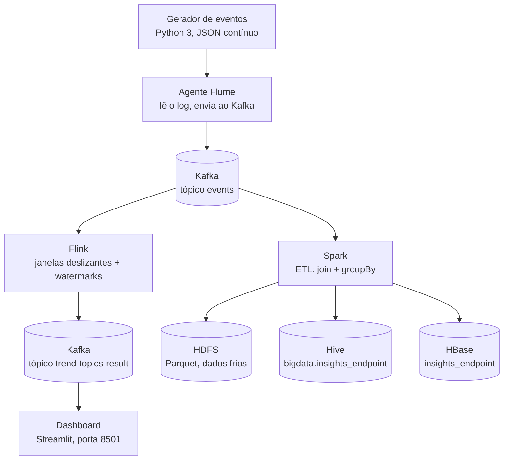

# Trabalho Big Data

Pipeline de Big Data com arquitetura **Lambda**: um caminho de processamento
em **tempo real** (Flink) e um caminho **batch** (Spark), alimentados pela
mesma fonte de eventos via Kafka.




## Sumário

- [Componentes](#componentes)
- [Pré-requisitos](#pré-requisitos)
- [Como rodar](#como-rodar)
- [Checklist de validação](#checklist-de-validação)
- [Justificativa das decisões técnicas](#justificativa-das-decisões-técnicas)
- [Troubleshooting](#troubleshooting)

## Componentes

| Camada | Serviço | Papel |
|---|---|---|
| Ingestão | `log-generator` | Gera eventos de acesso (JSON) continuamente |
| Ingestão | `flume-agent` | Lê o log e publica no Kafka |
| Mensageria | `zookeeper` / `kafka` | Fila de mensagens que desacopla produtores e consumidores |
| Tempo real | `jobmanager` / `taskmanager` | Cluster Flink: janelas deslizantes + watermarks |
| Tempo real | `dashboard` | Visualização Streamlit dos resultados do Flink |
| Batch | `spark` | Job de ETL (join + groupBy) gerando insights de negócio |
| Armazenamento | `namenode` / `datanode` | HDFS — dados frios em Parquet |
| Armazenamento | `hive-metastore` | Tabela SQL consultável (`bigdata.insights_endpoint`) |
| Armazenamento | `hbase` | Consulta por chave em baixa latência |

## Pré-requisitos

- Docker Desktop (Windows/Mac/Linux) com Docker Compose
- ~6 GB de RAM livres para os containers
- Portas livres no host: `8081`, `8501`, `9870`, `16010`. Como algumas portas
  "padrão" (`9092`, `9083`, `9090`) podem cair em faixas reservadas pelo
  Windows (Hyper-V/WSL2), este projeto já usa portas alternativas no host —
  veja a tabela abaixo.

| Serviço interno | Porta interna | Porta no host |
|---|---|---|
| Kafka | 9092 | **19092** |
| Hive Metastore | 9083 | **19083** |
| HBase Thrift | 9090 | **19090** |

> Os serviços continuam se comunicando entre si pelo nome interno e pela
> porta padrão (ex.: `kafka:9092`, `hbase:9090`) — só a porta exposta pro
> seu computador (Windows) mudou.

## Como rodar

### 1. Subir a infraestrutura

```powershell
docker-compose up -d
docker-compose ps
```

Espere **~40 segundos** antes do próximo passo — o NameNode do HDFS precisa
sair do *safe mode* na primeira subida.

### 2. Conferir a ingestão (gerador → Flume → Kafka)

```powershell
docker exec -it kafka kafka-console-consumer --bootstrap-server localhost:9092 --topic events --from-beginning --max-messages 5
```

### 3. Submeter o job Flink (tempo real)

```powershell
docker exec -it jobmanager flink run -d /opt/flink/usrlib/trend-topics-job.jar
docker exec -it jobmanager flink list
```

Acompanhe em `http://localhost:8081`. Após ~1-2 minutos, veja o resultado:

```powershell
docker exec -it kafka kafka-console-consumer --bootstrap-server localhost:9092 --topic trend-topics-result --from-beginning --max-messages 5
```

Dashboard em `http://localhost:8501`.

### 4. Preparar o HDFS (apenas na primeira vez)

```powershell
docker exec -it namenode hdfs dfs -mkdir -p /data/processed
docker exec -it namenode hdfs dfs -mkdir -p /user/hive/warehouse
```

### 5. Rodar o job Spark (ETL batch)

```powershell
docker exec -it spark /opt/spark/bin/spark-submit --master local[*] --packages org.apache.spark:spark-sql-kafka-0-10_2.12:3.5.1 --conf spark.hadoop.fs.defaultFS=hdfs://namenode:9000 /opt/spark-app/etl_insights.py
```

A primeira execução demora mais (baixa o conector Kafka via Maven).

## Checklist de validação

| Item | Como confirmar |
|---|---|
| ☑ Gerador Python 3 gerando eventos JSON | Passo 2 acima |
| ☑ Config do Flume versionada | `flume/conf/flume.conf` no repositório |
| ☑ Flink com janelas deslizantes + watermarks | Passo 3 acima; job `RUNNING` em `http://localhost:8081` |
| ☑ Spark com ETL e wide dependencies | Passo 5 acima; tabela de insights impressa no terminal |
| ☑ Dados em HDFS, Hive e HBase | Comandos abaixo |

```powershell
# HDFS
docker exec -it namenode hdfs dfs -ls /data/processed/insights_endpoint

# Hive
docker exec -it spark /opt/spark/bin/spark-sql --conf spark.hadoop.fs.defaultFS=hdfs://namenode:9000 -e "SELECT * FROM bigdata.insights_endpoint;"

# HBase
docker exec -it hbase hbase shell
# dentro do shell: scan 'insights_endpoint'
```

## Justificativa das decisões técnicas

### Flink (tempo real) em vez de Spark Structured Streaming

O Flink processa eventos **um a um**, nativamente, enquanto o Spark
Structured Streaming trata streaming como uma sequência de micro-lotes. Como
o requisito pedia janelas deslizantes sensíveis ao **tempo do evento** (não
ao tempo de chegada) com tratamento de atraso via watermarks — algo que é o
núcleo da API do Flink desde sua concepção — o Flink garante menor latência
e uma semântica de streaming mais fiel para o caso de "tendências em tempo
real" mostradas no dashboard.

### Spark (batch) para o ETL de insights de negócio

Para consolidar um grande volume de dados já acumulados usando **join** e
**groupBy** (transformações de *wide dependency*, com shuffle), o Spark é o
padrão de mercado: tem otimizador de consultas (Catalyst), integração nativa
com Hive/HDFS e é mais simples de operar em modo batch do que forçar uma
ferramenta de streaming a fazer esse trabalho.

### HBase além do HDFS

HDFS com Parquet é ótimo para leitura sequencial de grandes arquivos (data
lake, reprocessamento), mas ineficiente para uma consulta pontual e rápida
("me dê o resumo do endpoint `/checkout` agora"), pois exigiria escanear
arquivos inteiros. O HBase resolve exatamente essa lacuna: acesso indexado
por chave (row key) em milissegundos. Os três destinos de gravação não são
redundantes — cada um serve um padrão de acesso diferente:

- **HDFS** → dado bruto/frio, para reprocessamento e histórico;
- **Hive** → consultas analíticas ad-hoc via SQL;
- **HBase** → consulta operacional de baixa latência por chave.

### Kafka como camada intermediária

O Kafka desacopla produtores de consumidores: o gerador de eventos não
precisa saber quem vai consumir os dados, e múltiplos consumidores
independentes (Flink e Spark) podem ler o mesmo tópico `events`, cada um no
seu próprio ritmo, sem se afetarem. Além disso, funciona como buffer
durável — se um consumidor cair temporariamente, os eventos não se perdem.


## Estrutura do repositório

```
.
├── app/                  # Gerador de eventos (Python)
├── flume/                # Configuração do agente Flume
├── flink/                # Job Flink (Java + SQL) — janelas e watermarks
├── spark/                # Job Spark — ETL, HDFS, Hive, HBase
├── dashboard/            # Dashboard Streamlit
├── hadoop/conf/          # core-site.xml / hdfs-site.xml
├── docs/arquitetura.md   # Documentação da arquitetura
├── docker-compose.yml
└── README.md
```
