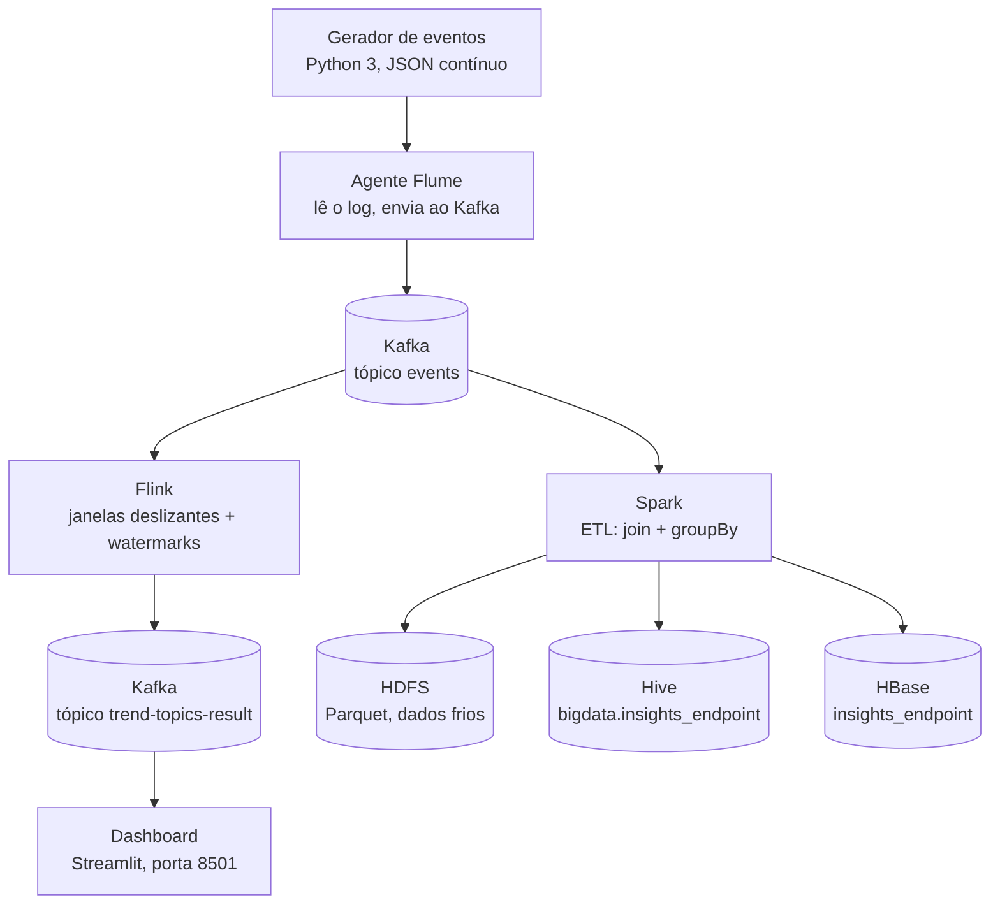

# Arquitetura do projeto

Pipeline de Big Data com dois caminhos de processamento (tempo real e batch)
a partir da mesma fonte de eventos.

## Camada de ingestão

- **Gerador de eventos** (`app/gerador.py`): script Python 3 que gera eventos
  de acesso (método, endpoint, status, tempo de resposta, IP) continuamente
  em JSON, gravados em log.
- **Flume** (`flume/conf/flume.conf`): agente com source `exec` (tail no log),
  channel `memory` e sink Kafka, publicando no tópico `events`.

## Caminho em tempo real

- **Flink** (`flink/job` e `flink/sql`): consome o tópico `events`, aplica
  janelas deslizantes com watermarks e publica os agregados no tópico
  `trend-topics-result`.
- **Dashboard** (`dashboard/app.py`): aplicação Streamlit que consome
  `trend-topics-result` e exibe os resultados em tempo real.

## Caminho batch (ETL de insights de negócio)

- **Spark** (`spark/job/etl_insights.py`): lê o tópico `events` em batch,
  faz um **join** com uma dimensão de endpoints e um **groupBy** de
  agregações (as duas transformações de *wide dependency* exigidas pelo
  trabalho), calculando métricas de negócio por endpoint (total de
  requisições, tempo médio de resposta, taxa de erro).
- O resultado é gravado em três destinos:
  - **HDFS** — arquivos Parquet em `/data/processed/insights_endpoint`.
  - **Hive** — tabela `bigdata.insights_endpoint`, consultável via SQL.
  - **HBase** — tabela `insights_endpoint`, para consulta por chave
    (endpoint) em baixa latência.

## Infraestrutura (docker-compose.yml)

| Serviço | Papel |
|---|---|
| `log-generator` | roda o gerador de eventos |
| `flume-agent` | ingestão dos logs para o Kafka |
| `zookeeper` / `kafka` | fila de mensagens |
| `jobmanager` / `taskmanager` | cluster Flink |
| `namenode` / `datanode` | HDFS |
| `hive-metastore` | metastore do Hive (Derby embutido) |
| `hbase` | banco de dados HBase (modo standalone) |
| `spark` | executa o job de ETL (modo local) |
| `dashboard` | visualização em tempo real (Streamlit) |